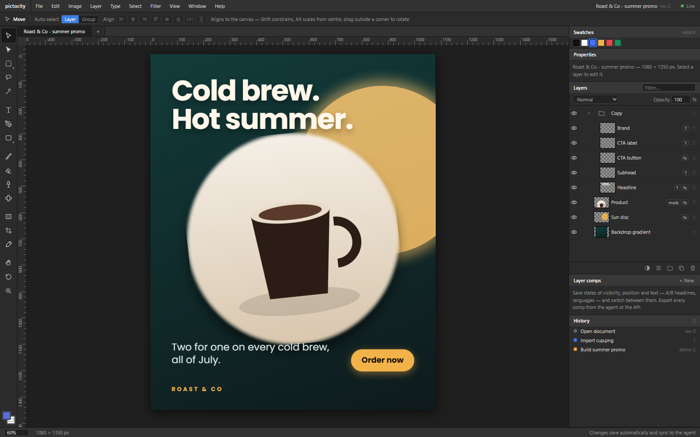

# pictocity

A Photoshop-style ad editor that an AI agent and a person edit together, live. (Pictocity is an independent project: it borrows conventions so your muscle memory transfers, not Adobe's code, icons or assets. Photoshop is a trademark of Adobe Inc.)

**Status:** v0.1.0 · Node 20+ · runs entirely on your machine — a local server on `localhost:4100` (loopback only by default), no account, no telemetry; nothing leaves the box unless you export it. What's missing is stated plainly in [What's next](#whats-next). MIT.

pictocity is the stills-and-layers half of a two-app pipeline: its sibling [Filmocity](https://github.com/SlightSignal/filmocity) is the video editor, built on the same idea — one document, human and agent editing it through the same operations, every change attributed and reversible. `skills/ad-campaign/SKILL.md` is the agent playbook for this app.



The document is a JSON layer tree. Everything else — the browser editor, the agent (via MCP), the exporter — reads and writes that document through the same operations, and one Canvas 2D renderer draws it in both the browser and Node. So what Claude sees in `render_preview` is exactly what you see on screen and exactly what gets exported.

```
┌─────────────────┐   ops over WebSocket   ┌──────────────────────┐   REST    ┌──────────────┐
│  Editor (React) │◄──────────────────────►│  Document server     │◄─────────►│  MCP server  │◄── Claude Code /
│  layers, tools, │                        │  JSON docs + history │           │  37 tools    │    Claude Desktop
│  history, fx    │                        │  headless renderer   │           └──────────────┘
└─────────────────┘                        │  assets, fonts, export│
                                           └──────────────────────┘
```

## Quick start

New to this? Choose **Code → Download ZIP** on this page and extract it (no Git or GitHub account needed), install **Node.js 20 or newer** from nodejs.org, then open a terminal in the extracted folder containing `package.json` — on Windows, click File Explorer's address bar, type `cmd`, and press Enter. Run these one at a time, letting the first two finish ([GETTING-STARTED.md](docs/GETTING-STARTED.md) walks the whole first session):

```text
npm install
npm run build
npm run server          # http://localhost:4100  (data lives in ./data)
```

`npm run server` keeps running — that's the app being served. Leave its window open, and in a **second** terminal in the same folder:

```text
npm run demo            # builds a sample ad through the API and exports it to data/exports/
```

Open <http://localhost:4100> and pick the demo document, or create a new one from a preset.

For editor development with hot reload: `npm run dev -w @pictocity/editor` (Vite on :5173, proxies to :4100).

Docker: `docker compose up --build` builds everything and serves on :4100 with data in a volume; `fonts/` and `image-tools.json` are mounted from the checkout. (Written carefully but not run here — no Docker in the sandbox.)

## Connect Claude

The MCP server is a thin client of the document server, so run the server first, then register the MCP server with your agent.

Claude Code:

```bash
claude mcp add pictocity -e PICTOCITY_URL=http://localhost:4100 -- node /path/to/pictocity/packages/mcp/dist/index.js
```

Claude Desktop: open **Settings → Developer → Edit Config** (this opens `claude_desktop_config.json`), add the `pictocity` entry below inside `mcpServers` without removing existing entries, replace `/path/to/pictocity` with your actual extracted folder using forward slashes (e.g. `C:/pictocity/packages/mcp/dist/index.js` on Windows), save, then fully quit and reopen Claude while the pictocity server stays running:

```json
{
  "mcpServers": {
    "pictocity": {
      "command": "node",
      "args": ["/path/to/pictocity/packages/mcp/dist/index.js"],
      "env": { "PICTOCITY_URL": "http://localhost:4100" }
    }
  }
}
```

If the agent runs on another machine, set `PICTOCITY_URL` to that host and open the editor at the same address. To keep strangers off a server on the network, set `PICTOCITY_TOKEN=<secret>` on the server: the API and WebSocket then require it (`PICTOCITY_TOKEN` in the MCP env; open the editor once as `http://host:4100/?token=<secret>` and it keeps it for the session). Set `PICTOCITY_AGENT` to name the agent ("claude" by default) — that name shows up in the History panel and in the orange "is editing" marker.

Tools: `list_documents`, `list_presets`, `list_fonts`, `install_font`, `create_document`, `create_variant`, `add_artboard`, `copy_to_artboard`, `get_document`, `add_layer`, `update_layer`, `remove_layer`, `move_layer`, `duplicate_layer`, `link_layers`, `merge_layers`, `import_asset`, `import_psd`, `list_image_tools`, `process_image`, `gc_assets`, `import_svg`, `search_layers` (by name, tag, type or text), `replace_text` (find/replace across every text layer), `save_comp`, `apply_comp`, `set_keyframes`, `combine_shapes`, `convert_to_path`, `check_spec`, `get_brand`, `set_brand`, `get_layer`, `apply_ops` (raw operations, for anything the specific tools don't cover), `render_preview` (returns an image the model can look at), `export_document` (png/jpg/webp with optional `trim`, or a layered psd), `get_history`. Layers can be referenced by id or by name.

## How the two of you work on one file

- Every change by either side is an **op** (`layer.add`, `layer.set`, `layer.move`, `layer.remove`, `layer.push`/`layer.splice` for lists such as brush strokes, `doc.set`, `asset.add`). In `layer.set`, `null` removes an optional property (`mask`, `styles`, `filters`, `crop`, `tags`). The server applies ops in order, bumps the revision, computes the inverse and broadcasts. The History panel shows the merged stream with a blue dot for you and an orange dot for the agent; click any entry to revert the document to that point.
- Undo/redo (⌘Z / ⇧⌘Z) undoes your own changes, even if the agent has edited in between.
- **Lock** a layer (padlock in the Layers panel, ⌘/) and nobody can move, edit or delete it — the agent gets a "Layer is locked" error until you unlock it. Use this for the parts you've finished by hand.
- **Tags** (`headline`, `cta`, `logo`, `product`…) live on layers so the agent can find things semantically; `get_history` lets it see what you changed since it last looked.
- Assets (images) are uploaded once and referenced by id; the agent can import from a URL, a path on the server machine, or base64.
- Presence: the agent's edits flash orange on the canvas and in the Layers panel; other people's cursors and selections show in green.
- Connection drops are survivable: the editor keeps editing, queues the changes, and replays them on top of the fresh snapshot when the socket comes back (a toast tells you how many were sent). The server pings every 25 s so proxies and sleeping laptops don't silently kill idle sockets, and the editor reconnects the moment its tab is visible again.
- The editor caches each rasterised layer and only re-renders what changed, and every layer rasterises in a canvas the size of its own (padded) bounds rather than the whole pasteboard — a one-layer drag on a four-artboard document went from 337 ms to 65 ms per frame on the CPU renderer.
- Auto-select is pixel-accurate like Photoshop's: clicking a transparent spot of a layer selects what's visible underneath (text boxes count as solid so you don't have to hit a glyph).

## The editor

Photoshop layout: menu bar, options bar, tools on the left, canvas in the middle, Properties / Layers / History on the right.

| Tool | Key | Notes |
| --- | --- | --- |
| Direct selection | A | Drag the anchors and handles of a path shape (pen paths) to reshape it. |
| Marquee | M | Rectangular or elliptical pixel selection (Shift+M switches); Shift constrains. Marching ants on the canvas. |
| Lasso | L | Freehand pixel selection. |
| Magic wand | W | Click a colour to select the contiguous area of the rendered image (tolerance in the options bar). |
| Move | V | Click to select (Shift adds), drag to move with snapping to canvas and layer edges/centres. Corner handles scale proportionally (Shift = free, Alt = from centre); drag just outside a corner to rotate (Shift snaps 15°). Several layers or a group get one transform box and scale/rotate together, text sizes included. Align and distribute buttons in the options bar (one layer aligns to the canvas, several to each other). Marquee-drag on empty canvas. Double-click text to edit inline. Number keys set opacity. |
| Type | T | Click for point text, drag for a paragraph box; clicking existing text edits it. Esc cancels, ⌘↩ or click away commits. |
| Shape | U | Rect, ellipse, line, polygon, star (Shift+U cycles). Shift keeps it square. |
| Pen | P | Click for corner points, drag for curve points; Enter or clicking the first point closes the path into a shape layer; Backspace removes the last point; Esc cancels. |
| Brush | B | Paints into the selected paint layer or starts a new one. Size, hardness, opacity in the options bar; `[` and `]` change size; pen pressure varies the width on a tablet. Strokes are stored as vectors in the document, so each stroke is one undo step and the agent can add or clear them. |
| Eraser | E | Erases on the selected paint layer (same controls). |
| Clone stamp | S | Alt-click a source, then paint: the stroke reproduces what lies below the layer from that offset, and the source follows your stroke. Stored as clone strokes on a paint layer, so it stays non-destructive. |
| Healing brush | J | Like the clone stamp, but keeps the destination's tone and takes only the source's texture (high-pass from the source, low-pass from the destination). |
| Gradient | G | Drag to add a gradient fill (foreground → background) over the artboard or canvas; the drag sets the stops, Shift snaps the angle. |
| Crop | C | Drag the area to keep, Enter applies (layers and guides shift with it), Esc cancels. |
| Eyedropper | I | Click the canvas to pick the foreground colour from the rendered image. |
| Hand | H / Space | Pan. Scroll pans, ⌘/Ctrl+scroll zooms. |
| Zoom | Z | Click in, Alt-click out. ⌘0 fit, ⌘1 100%, ⌘+ / ⌘−. |

Selections are multi-ring (several areas, holes): Shift-drag adds, Alt-drag subtracts on marquee, lasso and wand; the lasso has a polygonal mode (Shift+L); Select › Expand / Contract / Smooth / Border, Inverse, From layer transparency (or ⌘-click a layer thumbnail), Save / Load selections in the document, Reselect.

Pixel selections work the Photoshop way inside the vector model: brush and eraser strokes are clipped to the selection, Delete hides the selected area on the selected layers (an erase stroke on paint layers, a painted mask on everything else), Alt+Backspace fills it with the foreground colour as a shape layer, ⇧⌘I inverts within the artboard or canvas, ⇧⌘T transforms the selection (scale, rotate, move the marching ants; Enter finishes), Edit › Feather sets a soft edge for fills, deletes and masks, ⌘D deselects.

Edit › Transform › skew / distort / perspective drag the four corners (a real homography, identical in browser and export); Flip horizontal / vertical, Rotate 90° / 180° transform the selection (groups too). Layer › Merge selected into image (⌘E) rasterises layers with their effects into one image layer (also the `merge_layers` tool); Layer › Mask: reveal / hide selection turns a pixel selection into a layer mask; Copy / Paste layer style moves effects between layers. View › Show grid (⌘') with a configurable spacing; layers snap to it.

Masks: any layer can have a shape mask (rect/ellipse, feather, radius), a raster mask from an image, or a painted mask. Click a layer's `mask` badge or press `\` to paint the mask: the brush reveals, the eraser hides, exactly like painting white and black on a Photoshop mask. Mask strokes are vectors too, so they undo one at a time and sync to the agent.

⌘C / ⌘V copy and paste layers, including into another document on the same server (assets come along). Paste an image from the clipboard or drop image/PSD files on the window to place them (into the current artboard when one is selected); File › Place image from URL. The Character section warns when a text layer uses a font that isn't in `fonts/` (the browser would substitute it while exports use the server's copy).

Swatches panel with recent colours; Layers panel filter box (name, type or tag); document tabs above the canvas for the documents you've opened; Tab hides the panels; View › Zoom to selection (⇧⌘0); File › Duplicate document; Help › Keyboard shortcuts (?).

Rulers and guides: ⌘R toggles rulers, drag out of a ruler to create a guide, drag a guide back onto a ruler to delete it, ⌘; hides guides, View › Clear guides. Layers snap to guides while moving.

Layers: eye (Alt-click solos), lock, thumbnails, blend mode, opacity, rename (double-click), drag to reorder or into groups, Shift-click for ranges, fx/mask/link/clip badges. ⌘J duplicate, ⌘G group, ⇧⌘G ungroup, ⌘] / ⌘[ reorder (with Shift: to front/back), Delete removes, arrow keys nudge (Shift = 10 px).

Properties: transform, alignment, character (font, size, weight — only the weights actually installed — leading, tracking, kerning, baseline shift, horizontal/vertical scale, case, justify, underline, strikethrough, vertical type, wrap, per-character styling — select characters in the inline editor and the colour/weight/style/underline controls apply to just those; the styled ranges follow their characters when the text is edited later, by you or by the agent — text on a path — arc over the top, along the bottom, full circle, or a custom path — with along-path alignment, offset and flip), shape (fill, stroke, dash pattern, arrowheads on lines, per-corner radii), image fit and tools, fill (solid, multi-stop gradient with per-stop opacity in linear/radial/angle/reflected/diamond, pattern from an imported image), filters and adjustments (blur, brightness, contrast, saturation, hue, grayscale, grain, Levels, per-channel Curves, vibrance, exposure, colour balance, black & white, photo filter, gradient map, channel mixer, colorize, shadows/highlights, threshold, posterize; unsharp mask, motion blur, pixelate, emboss, find edges — as layer filters or as adjustment layers with masks), layer effects (drop shadow, inner shadow, stroke inside/outside/centre, outer glow, inner glow, bevel & emboss, color overlay, gradient overlay, pattern overlay from any imported image), layer masks (shape, raster, painted), blend mode, opacity and Fill opacity (pixels only, effects at full strength), tags.

File: new from presets (Instagram, story, banner sizes, A4…), open, open a Photoshop file, place image, canvas size (optionally scaling the layout to fit), new size variant (copies the document at another format with the layout scaled — the `create_variant` tool does the same), quick exports plus the Export As dialog described below; File › Clean up unused assets.

## Artboards

Layer › New artboard… (or the `add_artboard` tool) adds a format next to the existing ones and turns the document into a pasteboard. Each artboard is a group that clips its children to its frame; its background is a locked fill layer. Layers keep document coordinates, so a layer inside the second artboard starts at that artboard's x. Click a name tab to select an artboard and move or nudge it with its contents. Export one from the File menu or `export_document {artboard}`, or all at once (`Export all artboards`, `export_document {allArtboards: true}`), one file per artboard. Artboards survive the PSD round trip as real Photoshop artboards.

Turn one design into a set: Layer › New artboard… with "Move the existing layers into this artboard" (or `add_artboard {adoptExisting: true}`), add the other formats, then Edit › Copy to artboard… / `copy_to_artboard {fit: true}` copies layers into another artboard scaled and centred, with full-frame backgrounds stretched to the new frame. Adjust per format from there.

**Clipping masks.** Select a layer and Layer › Create clipping mask (⌥⌘G, or `clipToBelow: true` from the agent): it shows only where the nearest non-clipped layer below has pixels — a photo clipped into a shape, a gradient inside a headline. Clipped layers show a ↳ in the Layers panel, hide with their base, and round-trip through PSD as real clipping masks.

**Layer comps.** The Layer comps panel saves the current visibility, positions, opacities and text as a named state — A/B headlines, language variants — and switches between them. `save_comp` / `apply_comp` for the agent; `export_document {comp}` or `{allComps: true}` renders each variant to its own file.

**SVG.** File › Open SVG / Place SVG (or drop a .svg) imports paths, basic shapes, polygons, text, groups and transforms as editable layers; Export SVG writes vector layers natively and rasterises anything SVG can't express. `import_svg` / `export_document {format: "svg"}` for the agent.

**Shape operations.** Select two or more shape layers and Layer › Combine shapes: unite, subtract front, intersect, exclude overlap — the result is one editable path shape (`combine_shapes` for the agent). Layer › Convert shape to editable path turns a rectangle, ellipse, polygon or star into pen anchors you can reshape with Direct selection (`convert_to_path`): drag anchors and handles, double-click an anchor to toggle corner/smooth, Alt-click the outline to add one, Delete removes it. Layer › Insert shape adds one of twelve built-in custom shapes (arrows, heart, speech bubble, seal, bolt…). Layer style presets are saved on the server from the Properties panel.

**Linked layers.** Select layers and Layer › Link layers, or `copy_to_artboard {link: true}` when building the set: linked layers share content — text, fonts, colours, fills, images, effects, filters — while position, size and font size stay per layer. Change the headline on one format and every format follows, inside the same change and the same undo. The server does the propagation, so it works identically for you and the agent. `link_layers` / Unlink remove it.

**Video ads.** `export_document {format: "mp4" | "webm", audio, fps, scale}` renders the timeline to H.264 or VP9 through ffmpeg and muxes in an audio file — a path or a URL, typically the soundstudio render — so an animated creative plus a mixed spot becomes one finished video ad. Frames stream to ffmpeg with a layer cache (a 15 s, 24 fps spot with three animated layers renders in about 11 s). Group the layers you animate (a button with its label) so they move together.

**Timeline (animated banners).** View › Show timeline (⌥⌘T): scrub, play, and add keyframes for the selected layers at the playhead — position, opacity, rotation and scale interpolate between them with per-keyframe easing. Export the timeline as an animated GIF (one global palette across frames, so flat colours don't flicker) or as a self-contained HTML5 banner (static layers baked into one JPEG, animated layers driven by CSS keyframes, `ad.size` meta included). From the agent: `set_keyframes`, then `export_document {format: "gif" | "html"}`.

## Output quality

- **Float pipeline.** Colour ops (brightness, contrast, saturation, hue, grayscale, sepia, invert), Levels, Curves and every adjustment run in one floating-point pass with a single TPDF-dithered quantisation at the end — no intermediate 8-bit rounding. Gradient fills are computed per pixel in float as well, and when a fill layer carries per-pixel adjustments the whole chain stays in float. Measured: a subtle 0–48 gradient stretched to full range comes out with 256 distinct levels in steps of 1; the old 8-bit chain gave ≤48 levels in steps of 5.
- **Lanczos-3 resampling** whenever a photo is shown at less than ~80 % of its size, prefiltered so it doesn't alias (a 1-px checkerboard downsampled 8× reads a flat 128, not stripes). Results are cached per asset and size.
- **Linear-light blending** (Image › Mode, Preferences, or `create_document {linearBlending: true}`): gradients and blurs interpolate in linear light — the red→green midpoint is a bright yellow (188,188,0) instead of sRGB's olive (127,127,0), and a blur across a colour seam keeps its brightness. Off by default to match Photoshop; on when you want the physically correct result.
- **Magic wand at document resolution** regardless of zoom (capped at 4096 px).
- Still 8-bit sRGB at the edges: no 16-bit documents, no ICC/CMYK. For web-delivered ads that's the delivery format anyway; for print, treat exports as sRGB.

## Files, saving and exporting

- **Open (⌘O)**: server documents as thumbnail cards with search, sort and rename/duplicate/delete; recent documents; *Open from computer* takes `.pictocity` packages, `.psd`, `.svg`, or any image (which opens as its own document, like Photoshop).
- **Save (⌘S)** confirms what's already true — every change is on the server. **Save As (⇧⌘S)** renames, saves a copy, or downloads the document as a portable `.pictocity` file (JSON with the images embedded, re-openable on any pictocity server) or as `.psd`.
- **Export As (⌥⇧⌘W)**: PNG, PNG-8 (palette, for ad weight limits), JPEG, WebP, AVIF, GIF (animated from the timeline), TIFF, BMP, PDF (one page per artboard), SVG, PSD, HTML5 banner, `.pictocity` package; quality, palette size, 0.5×–3× scales with `@2x`-style suffixes, transparent background, trim, DPI, scope (canvas / each artboard / current artboard / each comp), download or save to the server's exports folder (File › Show exports… lists them with links). The `export_document` tool takes the same options.
- **Image menu**: Adjustments (⌘L Levels, ⌘M Curves, ⌘U Hue/Sat, ⌘B Color Balance, ⌘I Invert, ⇧⌘U Desaturate, and the rest — applied to the selected layers or as an adjustment layer), Image/Canvas Size (⌥⌘I), Image Rotation 90°/180°, Crop, Duplicate.
- **Type**, **Filter** and **Window** menus round out Photoshop's menu set; the Filter menu applies non-destructive filters to the selected layers.

Photoshop shortcuts now covered beyond the tools: X / D colours, F screen modes, Tab / Shift-Tab panels, R rotate view, ⌘T free transform (with an X/Y/W/H/∠ options bar), ⌘X cut, ⇧⌘C copy merged (flattened image to the clipboard), ⇧⌘V paste in place, ⌥-drag duplicates with the Move tool, ⌘H hide Extras, ⌥⌘; lock guides, ⇧⌘N / ⌥⇧⌘N new layer, ⇧⌘E merge visible, ⇧⌘D reselect, ⌘⌫ fill with background, ⇧[ ] brush hardness, ⇧1–0 fill opacity, ⇧⌘> / < font size, ⌥←→ tracking, ⌘K preferences, ⌘W close, ⌥⌘Z / ⌘Y undo and redo aliases. The full sheet is under Help (?).

## Spec checks and the brand kit

`check_spec {platform, artboard}` (or Image › Check against platform spec…) audits a creative against `meta-feed`, `meta-story`, `google-display`, `youtube-thumbnail`, `linkedin`, `x`, `pinterest` or `print`: accepted sizes and aspects, the platform's UI safe zones (text, CTA and logo must sit inside), text coverage, minimum legible type size, text/background contrast (WCAG ratio), a present CTA, and — with `weigh: true` — export weight against the platform's limit. Issues come back with severities and a 0–100 score; the tests pin the behaviour on known-good and known-bad layouts.

`get_brand` / `set_brand` store one brand kit per server: colours with roles, fonts, logo, voice, hard rules, audio identity. Brand colours appear at the top of the Swatches panel, and the agent reads the kit before it designs.

`skills/ad-campaign/SKILL.md` is the agent's playbook: brief → brand → master format → linked format set → comps for copy and languages → spec checks → exports, plus the audio spot in soundstudio. Point your agent at it.

## Presets

New-document and artboard presets are grouped: Social (Instagram/Facebook feed, story and reel, X, LinkedIn, Pinterest, YouTube, Snapchat), Display (all IAB/Google Ads sizes incl. mobile and responsive), Screens (HD, 4K, signage) and Print at 300 dpi (A-series, US Letter, business card, postcard, DL flyer, poster). Gradient presets (foreground-to-transparent, sunset, ocean, photo fade…) sit in the gradient editor; eight layer-style presets (soft/hard shadow, outlines, neon, emboss, sticker, gold foil) are installed on first run and editable from the Properties panel; twelve custom shapes are under Layer › Insert shape.

## Image tools

Image tools take an image layer's picture and produce a new one. `knockout_background` is built in: an edge flood fill that follows gradients but stops at the subject (magic wand + delete), with `tolerance` and `feather` params. Anything else plugs in through `image-tools.json` next to `package.json` (see `image-tools.example.json`) — a command line with `{in}` and `{out}` PNG paths and any `{params}`, so rembg, an upscaler, or a generative-fill script all work the same way:

```json
{ "remove_background": { "description": "rembg", "command": "rembg i -m {model} {in} {out}", "params": { "model": "u2net" } } }
```

Run them from the Image section of the Properties panel, or with the `process_image` tool (`mode: "replace"` swaps the layer's image, `"new_layer"` keeps the original underneath). `list_image_tools` shows what's configured. The Image section also has Replace… to swap the picture for another file while keeping the layout.

## Photoshop files

Export as `.psd` and the file opens in Photoshop with the layer structure intact: groups, names, visibility, opacity and blend modes; text layers as editable type (font, size, colour, tracking, leading, paragraph box); layer effects as real layer styles (drop shadow, inner shadow, outer glow, inner glow, bevel, stroke, colour overlay, gradient overlay); layer masks (shape, raster or painted) as real masks; character style runs both ways. Content is rasterised per layer, so shapes and images arrive as pixels. Adjustment layers become Photoshop brightness/contrast, hue/saturation or invert adjustment layers where the filters allow it (blur and sepia have no equivalent).

Open a `.psd` (File › Open Photoshop file, the Open dialog, or the `import_psd` tool) and the reverse happens: raster layers become image layers, type layers become text layers, styles and masks come back, groups are preserved. Smart objects and adjustment layers arrive as pixels (or are dropped if they carry none). Font names are mapped from PostScript names, so put the matching `.ttf`/`.otf` in `fonts/` for identical rendering.

## Document format

```jsonc
{
  "id": "doc_…", "name": "Summer promo", "width": 1080, "height": 1350, "background": "#0f1a1c",
  "layers": [                       // bottom to top, like the Layers panel read upwards
    { "id": "l_1", "type": "fill", "name": "Backdrop", "fill": { "kind": "linear", "from": "#123c3a", "to": "#0f1a1c", "angle": 160 }, "x": 0, "y": 0, "width": 1080, "height": 1350, "opacity": 1, "blend": "normal", "rotation": 0, "scaleX": 1, "scaleY": 1, "visible": true, "locked": false },
    { "id": "l_2", "type": "image", "assetId": "a_1", "fit": "cover", "mask": { "kind": "shape", "shape": "ellipse", "x": 0, "y": 0, "width": 800, "height": 800, "feather": 6 }, "styles": { "dropShadow": { "enabled": true, "color": "#000", "blur": 40, "x": 0, "y": 30, "opacity": 0.55 } }, "tags": ["product"], "…": "…" },
    { "id": "l_3", "type": "group", "name": "Copy", "children": [ { "type": "text", "text": "Cold brew.\nHot summer.", "fontFamily": "Poppins", "fontSize": 108, "fontWeight": 700, "color": "#fff7ea", "wrap": true, "…": "…" } ] }
  ],
  "assets": { "a_1": { "id": "a_1", "name": "cup.png", "src": "/assets/a_1.png", "width": 800, "height": 800, "mime": "image/png" } },
  "rev": 12
}
```

Layer types: `text`, `shape` (rect/ellipse/line/polygon/star/path), `image`, `fill`, `adjustment` (filters everything below it), `brush` (vector strokes with size/color/opacity/hardness, `erase: true` for eraser strokes), `group` (pass-through unless it has opacity/blend/mask/styles; `artboard: true` clips children to the frame). Full typings are in `packages/core/src/types.ts`; the schema is also what the MCP tools validate against.

## REST API (what the MCP server uses — use it from anything)

| Method | Path | |
| --- | --- | --- |
| GET | `/api/docs` | list documents |
| POST | `/api/docs` | `{name,width,height,background}` → document (or `{document}` to import a whole one) |
| POST | `/api/docs/import-psd` | PSD bytes with `x-filename`, or JSON `{path}` → new document |
| POST | `/api/docs/:id/variant` | `{width,height,name?,scaleContent?}` → copy at another size with the layout scaled |
| POST | `/api/docs/:id/process` | `{tool, assetId, params?}` → run an image tool, returns the new asset |
| POST | `/api/docs/:id/rasterize` | `{layerIds}` → render those layers with effects into a new asset (merge / rasterize) |
| GET | `/api/image-tools` | configured image tools |
| GET / DELETE | `/api/docs/:id` | |
| POST | `/api/docs/:id/ops` | `{ops, actor, label}` → `{rev, inverse}` |
| GET | `/api/docs/:id/history?since=rev` | applied ops with actor, label, inverse |
| POST | `/api/docs/:id/assets` | JSON `{url}` / `{path}` / `{base64,name,mime}`, or raw bytes with `x-filename` |
| GET | `/api/docs/:id/render.png?scale=0.5&layer=id&artboard=id` | preview (layer = one layer on transparent; artboard = that frame only) |
| GET / POST | `/api/docs/:id/export` | `format=png|png8|jpg|webp|avif|gif|tiff|bmp|pdf|svg|psd|html|mp4|webm`, `scale`, `quality`, `colors`, `dpi`, `transparent`, `trim`, `artboard`, `comp`, `fps`, `audio` (mp4/webm), `crf`; POST `path` writes to disk, `{artboards:true}` writes one file per artboard (or one multi-page PDF), `{comps:true}` one per comp |
| GET | `/api/docs/:id/package` | portable `.pictocity` file (document + images) |
| POST | `/api/docs/import-package`, `/api/docs/import-svg` | restore a package / import an SVG |
| GET | `/api/exports`, `/api/assets` | list exported files / asset files with usage; `POST /api/assets?gc` deletes unused assets |
| GET | `/api/fonts`, `/api/presets` | |
| POST | `/api/fonts` | install a font: raw file with `x-filename`, or JSON `{path}` / `{url}` |
| WS | `/ws` | `subscribe`, `ops`, `presence` → `snapshot`, `applied`, `rejected`, `presence` |

Environment: `PICTOCITY_PORT` (4100), `PICTOCITY_DATA` (./data), `PICTOCITY_FONTS` (./fonts), `PICTOCITY_IMAGE_TOOLS` (./image-tools.json), `PICTOCITY_TOKEN` (optional shared secret), `PICTOCITY_MAX_BODY_MB` (upload limit, 200). Assets are served with immutable cache headers (their ids are unique).

## Fonts

Drop `.ttf` / `.otf` files into `fonts/`, or install them without touching the server: File › Install font… in the editor, or the `install_font` tool (path or URL). The server registers them for headless rendering and serves them to the browser with `@font-face`, so both sides draw the same glyphs. Poppins is included. System fonts on the server machine are also available to the renderer, but the browser will only match them if they're installed there too — prefer the `fonts/` folder.

## Testing

Three layers of verification ship with the code:

- `npm test` — `tools/core-tests.mjs`, ~70 property tests that need no browser: every op's inverse restores the document exactly; a kitchen-sink document of every feature renders and re-imports from its own SVG; neutral adjustments are pixel identities and non-neutral ones change pixels; Fill 0% + stroke leaves the interior empty; homographies map corners exactly and flips are involutions; selection boolean areas; keyframe exactness and monotone interpolation; wrapped text never exceeds its box; closed paths keep their anchor count through edits; PSD round trips keep groups, text, shapes and adjustments; validation rejects NaN, zero sizes, unknown blend modes and types, clamps opacity, and fills defaults into incomplete layers; output quality: no banding on stretched gradients, no aliasing on downsampled photos, linear-light midpoints and seams, colour ops matching their CSS-filter definitions.
- `npm run test:api` — `tools/api-tests.mjs`, ~30 checks against a running server: 404/400 paths, batch atomicity, lock enforcement, abuse limits (giant render scales, absurd fps, out-of-range quality, path traversal), 20 concurrent writers with sequential revisions, WebSocket garbage tolerance and rejection reasons, on-disk JSON validity after bursts (writes are atomic).
- `npm run test:ui` — `tools/ui-smoke.mjs`, ~200 headless-Chromium flows through the real editor against a running server (every tool, dialog, shortcut group, live sync, offline replay, cross-document paste, exports of every format).
- `npm run doctor` — first-run environment check: Node version, builds, the native canvas binary on this platform, fonts, writable data folder, free port, image-tools config, token.

The editor's renderer and the export renderer are held to the same output by a test (browser vs server render of a document with text, effects and filters differ on under 1% of pixels, all at anti-aliased glyph edges). SIGTERM/SIGINT flush debounced saves before exit, so stopping the container never loses the last edit; closing a tab with edits still queued offline asks first; a corrupt document file is skipped with a warning instead of stopping the server.

Limits are enforced rather than hoped for: renders and exports cap at 16384 px per side / 64 MP, GIF fps at 1–60, quality 1–100, palette 2–256, document sides 1–8192; unknown formats and op types are 400s; document saves are atomic (temp file + rename). Agent layer references accept an id, a unique name, or `Artboard name/Layer name`; an ambiguous name fails with the candidates listed instead of picking one.

The op model validates everything it applies: a malformed or hostile operation (from the editor, the agent, or a file) can't leave a NaN, a zero-sized box or an unknown type in a document; incomplete layers are normalised with defaults; required properties can't be cleared, optional ones clear cleanly so undo is exact.

The renderer and MCP server are exercised by `npm run demo` (builds an ad through the API and exports it) and by connecting any MCP client.

## Layout of the code

```
packages/core     document schema, ops + inverses, geometry, the renderer (browser + Node)
packages/server   HTTP + WebSocket server, persistence, assets, fonts, headless render/export, PSD in/out, demo
packages/mcp      MCP server (stdio) exposing the document server as tools
packages/editor   React editor (Vite)
tools/            headless UI smoke test
fonts/            fonts served to both renderers
data/             documents, history, assets, exports (created at runtime)
```

## What's next

Not built (and honest about it): satin / contours / global light / blend-if, warp text, colour management and CMYK/print units (TIFF and PDF export exist, but as 8-bit sRGB), quick/object selection (an ML step — plug a model in through image tools), brush tips and dynamics, navigator/rotate-view/info panels. PSD import stays lossy for smart objects. On the AI side the plumbing is in place — point `image-tools.json` at a background remover, an upscaler or a generative-fill script and the agent can call them; image generation straight into a layer is the natural next tool.

Sync is server-authoritative with last-write-wins per property; that's the right trade-off for one person plus one agent. If you want offline editing or a crowd, the op layer is where a CRDT (Yjs) would slot in.
